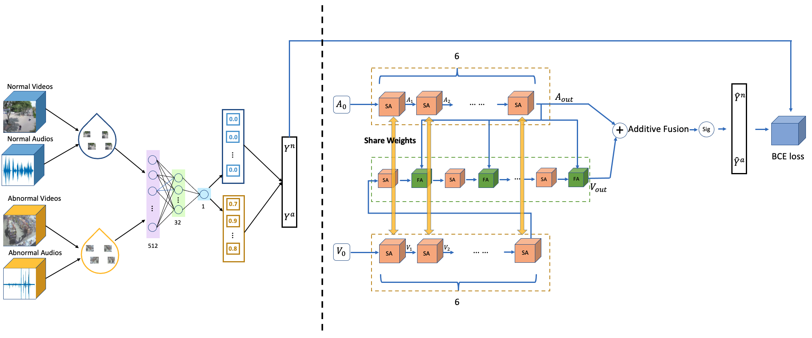
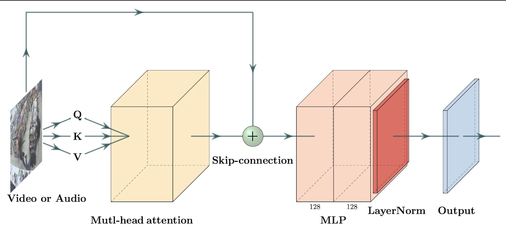
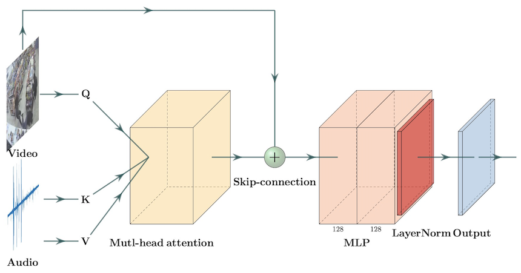

# ACF Network: For Multi-Modal Violence Detection 
	
There are official codes for ICASSP2021 paper "LOOK, LISTEN AND PAY MORE ATTENTION: FUSING MULTI-MODAL INFORMATION FOR VIDEO VIOLENCE DETECTION"

Structure of our method

Structure of SA unit and FA unit

## Updates
**`[September 22th]`** 
Our codes and more details about the work will be released soon. Looking forward to your attention!

## Datasets
[XD-Violence](https://roc-ng.github.io/XD-Violence/)
These datasets are from the official github of "Not only Look, but also Listen: Learning Multimodal Violence Detection under Weak Supervision (ECCV2020)".

Based on their ground truth we have created a new format test_frame_mask for our method, which has been published in our repository.

## Requirements
- python>=3.6
- pytorch=1.5.0+cu101
- torchvision=0.6.0+cu101
- scikit-learn
- numpy
- apex
- yacs
- opencv
