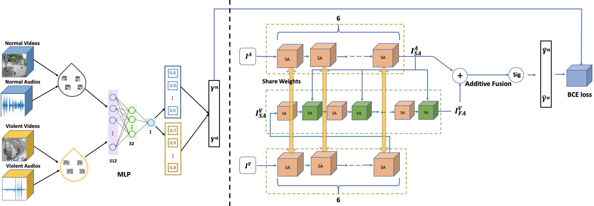

# ACF Network: For Multi-Modal Violence Detection 
	
These are official codes for ICASSP2022 paper "LOOK, LISTEN AND PAY MORE ATTENTION: FUSING MULTI-MODAL INFORMATION FOR VIDEO VIOLENCE DETECTION"

Overall Structure 

## Updates
**`[September 30th]`** 
Our codes and more details about the work will be released soon. Please stay tuned.

## Datasets
[XD-Violence](https://roc-ng.github.io/XD-Violence/)
XD-Violence This dataset is from the official GitHub of "Not only Look, but also Listen: Learning Multimodal Violence Detection under Weak Supervision (ECCV2020)".

Based on their ground truth, we have created a new format frame_mask of the test dataset for our method and published it in the repository.

## Visualization
 Visualization results of violence scenes
 

 Visualization results of fused attention
 

## Requirements
- python>=3.6
- pytorch=1.5.0+cu101
- torchvision=0.6.0+cu101
- scikit-learn
- numpy
- apex
- opencv
